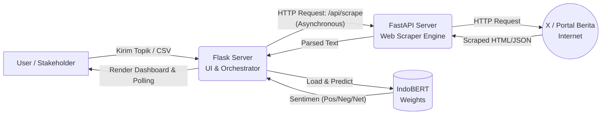
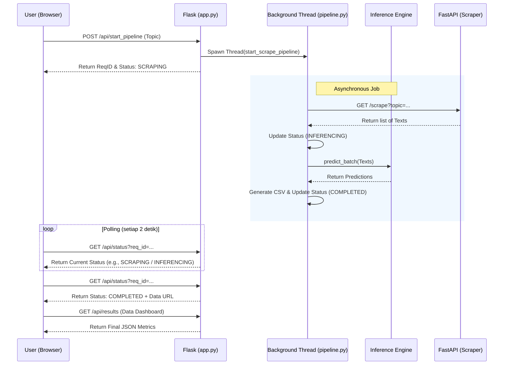
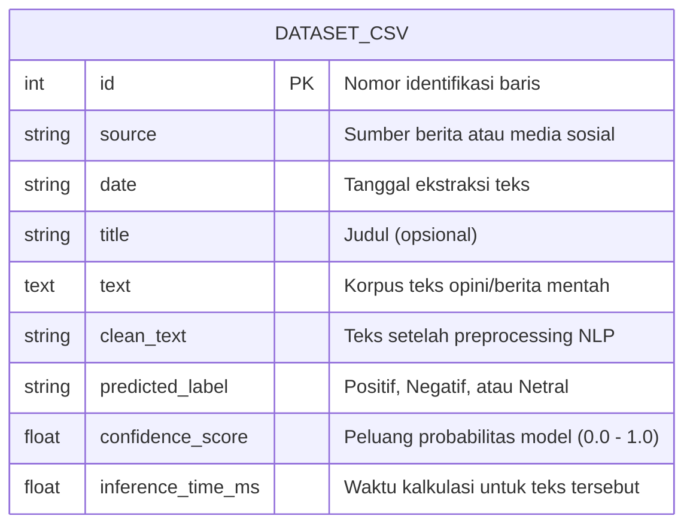
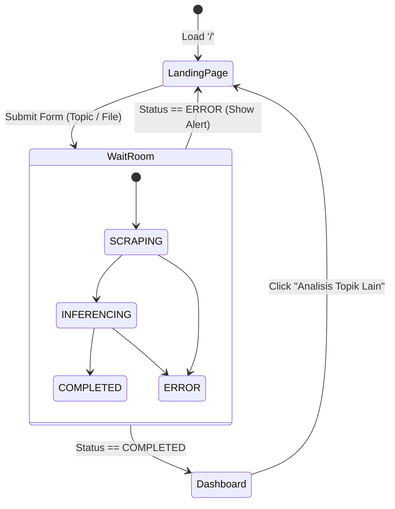

# BAB 3: METODOLOGI PENELITIAN

## 3.1 Tahapan Penelitian
Penelitian ini menggunakan pendekatan rekayasa perangkat lunak (Software Engineering) berbasis siklus prototipe (Prototyping Model) yang terdiri dari lima tahapan utama:
1. **Analisis Kebutuhan Sistem:** Mengidentifikasi kebutuhan fungsional (scraping, inferensi model, UI interaktif) dan non-fungsional (performa <3 detik untuk dashboard awal, keamanan background thread).
2. **Pengumpulan Dataset & Pembangunan Model:** Persiapan dataset Dummy/Pre-Computed, eksperimen *fine-tuning* pada IndoBERT, serta konversi pipeline *HuggingFace Transformer* untuk mendukung klasifikasi polaritas 3 kelas.
3. **Desain Sistem & Arsitektur:** Perancangan topologi Microservices yang memisahkan beban antara Flask API dan Scraper API.
4. **Implementasi & Pengkodean:** Pembuatan antarmuka web, logika *Live Polling*, serta pengikatan model NLP (*inference engine*) dengan modul Scraper.
5. **Pengujian & Evaluasi:** Melakukan skenario uji *System Tests* (Network failure, text over-length) dan evaluasi performa model melalui matriks kebingungan (Confusion Matrix).

## 3.2 Arsitektur Sistem (System Context)
Sistem "Sentiments" menganut arsitektur *decoupled* yang asinkron guna mengatasi lambatnya jaringan web pada saat *scraping* teks. Berikut adalah diagram konteks integrasi antar layanan dalam ekosistem sistem.

Pada desain di atas, *Flask* bertindak sebagai otak utama (Orchestrator) yang menangani sesi pengguna, antarmuka statis, serta melakukan inferensi model. Sedangkan *FastAPI* khusus menangani tugas Scraping yang didasarkan pada Playwright/BeautifulSoup tanpa memblokir server utama.

## 3.3 Alur Sekuensial Pipeline (Sequence Diagram)
Untuk mencegah peramban (*browser*) "membeku" saat memuat proses NLP dan komputasi yang berat, UI Frontend melakukan penarikan data secara berkala (AJAX Polling) setiap 2 detik ke titik henti `/api/status`.

## 3.4 Desain Skema Data (ER Diagram)
Data hasil ekstraksi sentimen yang didapatkan dari *pipeline* disimpan pada berkas `.csv` statis sebagai basis data sementara (Caching System) untuk memotong waktu muat ulang dashboard di masa depan.

## 3.5 Pra-pemrosesan Data (Preprocessing)
Model *Transformer* mengharuskan teks yang bersih untuk menghasilkan *embedding* vektor kata yang kuat. Modul pra-pemrosesan (`preprocessing.py`) melakukan pembersihan secara konsekutif:
1. **Case Folding & Cleaning**: Pengubahan karakter ke huruf kecil, penghapusan *username* (tag @), tagar (#), tautan (URL), karakter non-ASCII, dan tanda baca yang berlebihan.
2. **Normalisasi**: Transformasi kata-kata slang (bahasa gaul) maupun singkatan (seperti *yg*, *dgn*, *tdk*) menjadi ejaan baku Bahasa Indonesia (EYD) berdasarkan kamus (dictionary) yang dikonfigurasi pada sistem.
3. **Stopword Removal**: Menghapus kata hubung yang tidak membawa bobot sentimen (seperti *yang, dan, di, dari*).
4. **Tokenization (HuggingFace)**: Mengubah string teks ke dalam deret integer (Input IDs, Attention Mask) menggunakan `AutoTokenizer` dengan parameter *truncation* aktif yang memotong teks jika melebihi kuota memori (*MAX_TOKEN_LENGTH* = 512).

## 3.6 Transisi Antarmuka Frontend (State Machine)
Antarmuka Web (UI) dibangun sebagai *Single Page Application* tanpa framework tambahan (Vanilla JS). Transisi siklus hidup halaman dapat dimodelkan pada diagram status di bawah ini:

